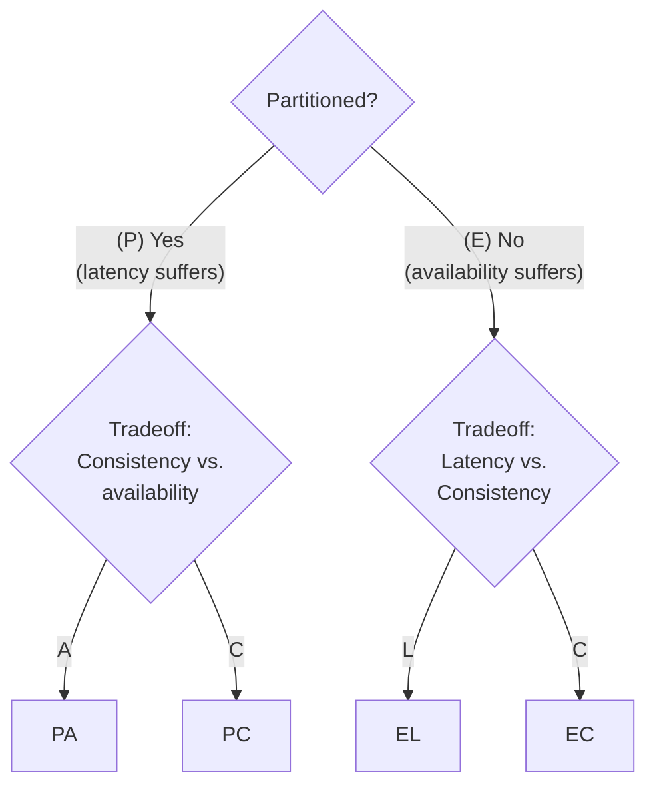

# PACELC theorem

- PA/EL: prioritize availability and latency over consistency
- PA/EC: when there is a partition, choose availability; else, choose consistency
- PC/EL: when there is a partition, choose consistency; else, choose latency
- PC/EC: choose consistency at all times
    - MySQL cluster, BigTable
