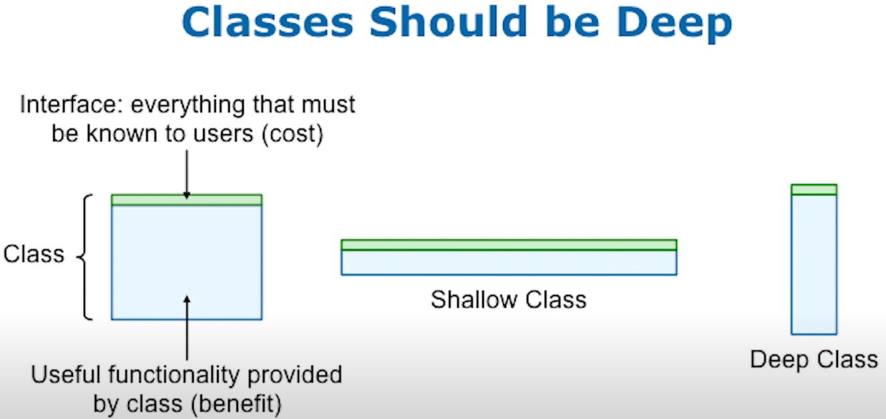

# Deep Modules

## Classes should be deep

Interface defines everything known to the outside. It is like cost.
Functionality provided by class is like value.
So the goal is to minimize cost and maximize value.

https://cactus-proj.github.io/A-Philosophy-of-Software-Design-zh/ch05.html#_5-2-information-leakage-%E4%BF%A1%E6%81%AF%E6%B3%84%E6%BC%8F
